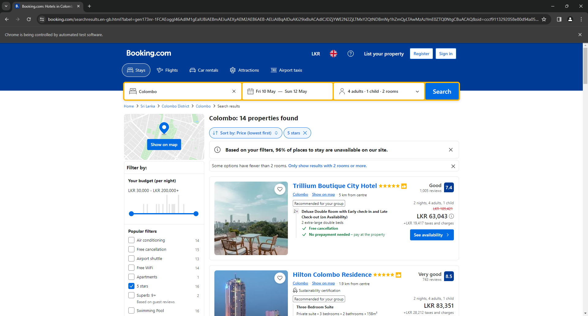
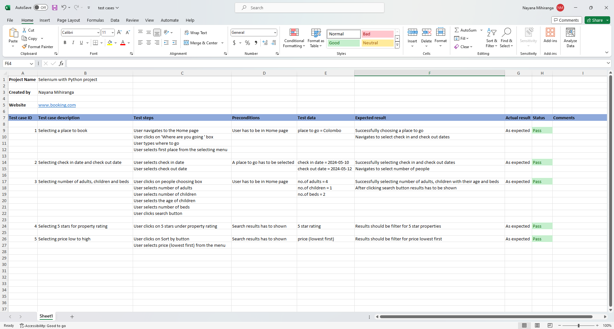

<h1 align="center">Selenium with Python project</h1>  

  This project streamlines the process of finding accommodations on Booking.com by Automating the process using Selenium with Python.

 
Automated processes:
 
 
1. Selecting a place to book  
2. Selecting a check-in date  
3. Selecting a check-out date  
4. Selecting the number of adults  
5. Selecting the number of children  
6. Selecting the age of the children  
7. Selecting the number of rooms  
8. Clicking the search button  
9. Filtering 5 stars for property rating  
10. Filtering price low to high  

---

  Selenium | Python | Test Automation | Test Cases

---

### Screenshot:

 

### Test Cases:

